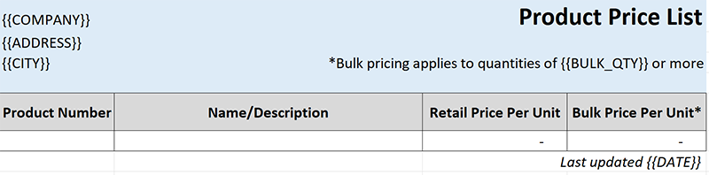
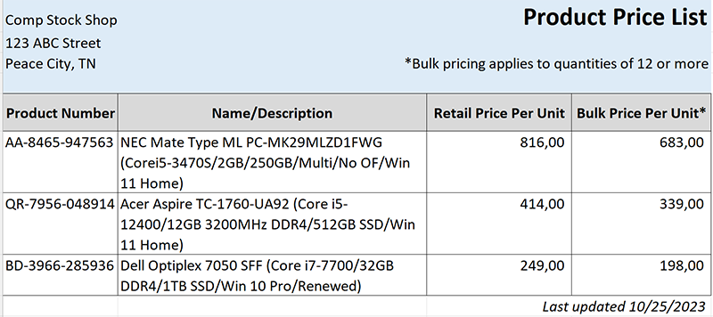

# FastExcelTemplator

**FastExcelTemplator** is a part of the **FastExcelPhp Project** which consists of

* [FastExcelWriter](https://packagist.org/packages/avadim/fast-excel-writer) - to create Excel spreadsheets
* [FastExcelReader](https://packagist.org/packages/avadim/fast-excel-reader) - to reader Excel spreadsheets
* [FastExcelTemplator](https://packagist.org/packages/avadim/fast-excel-templator) - to generate Excel spreadsheets from XLSX templates
* [FastExcelLaravel](https://packagist.org/packages/avadim/fast-excel-laravel) - special **Laravel** edition

## Introduction

**FastExcelTemplator** can generate Excel-compatible spreadsheets in XLSX format (Office 2007+) from XLSX templates,
very quickly and with minimal memory usage. This library is designed to be lightweight, super-fast and requires minimal memory usage.

**Features**

* Supports XLSX format only (Office 2007+) with multiple worksheets
* Transfers from templates to target spreadsheets styles, images, notes
* Replaces the entire cell values and substrings
* You can use any row from a template as row template to insert and replace a row with new values
* The library can read styling options of cells - formatting patterns, colors, borders, fonts, etc.

## Installation

Use `composer` to install **FastExcelTemplator** into your project:

```
composer require avadim/fast-excel-templator
```

## Usage

Example of template



From this template you can get a file like this



```php
// Open template and set output file
$excel = Excel::template($tpl, $out);
// Get the first sheet
$sheet = $excel->sheet();

$fillData = [
    '{{COMPANY}}' => 'Comp Stock Shop',
    '{{ADDRESS}}' => '123 ABC Street',
    '{{CITY}}' => 'Peace City, TN',
];

// Replaces entire cell values for the sheet
// If the value is '{{COMPANY}}', then this value will be replaced,
// but if the value 'Company Name {{COMPANY}}', then this value will not be replaced 
$sheet->fill($fillData);

// Replaces any occurring substrings
// If the value is '{{DATE}}' or 'Date: {{DATE}}', then substring '{{DATE}}' will be replaced,
$replaceData = ['{{BULK_QTY}}' => 12, '{{DATE}}' => date('m/d/Y')];
$sheet->replace($fillData);
```

Also, you can use any row as a template

```php
// Get the specified row (number 6) as a template
$rowTemplate = $sheet->getRowTemplate(6);
// You can insert template row many times with new data
$rowData = [
    // Value for the column A
    'A' => 'AA-8465-947563',
    // Value for the column B
    'B' => 'NEC Mate Type ML PC-MK29MLZD1FWG',
    // And so on...
    'C' => 816,
    'D' => 683,
];
// Replace row 6 instead of a template row
$sheet->replaceRow(6, $rowTemplate, $rowData);

// New data for the new row
$rowData = [
    // ...
];
// Add new row from the same template after the last insertion
$sheet->insertRowAfterLast($rowTemplate, $rowData);

// ...
// Save new file
$excel->save();

```

You can find code examples in */demo* folder

## List of functions
### Class Excel

Excel::template($template, $output);

* fill(array $replacement) - Replaces the entire cell value for all sheets
* replace(array $replacement) - Replaces a substring in a cell for all sheets
* save()

### Class Sheet

* fill(array $replacement) - Replaces the entire cell value for the sheet
* replace(array $replacement) - Replaces a substring in a cell for the sheet
* getRowTemplate($rowNumber) - Gets template from the row
* insertRow($rowNumber, $rowTemplate, ?array $cellData = [])
* replaceRow($rowNumber, $rowTemplate, ?array $cellData = [])
* insertRowAfterLast($rowTemplate, ?array $cellData = [])

## Do you like FastExcelTemplator?

if you find this package useful you can support and donate to me for a cup of coffee:

* USDT (TRC20) TSsUFvJehQBJCKeYgNNR1cpswY6JZnbZK7
* USDT (ERC20) 0x5244519D65035aF868a010C2f68a086F473FC82b
* ETH 0x5244519D65035aF868a010C2f68a086F473FC82b

Or just give me a star on GitHub :)