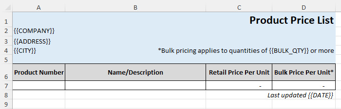
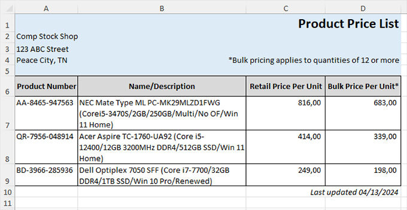
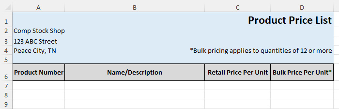
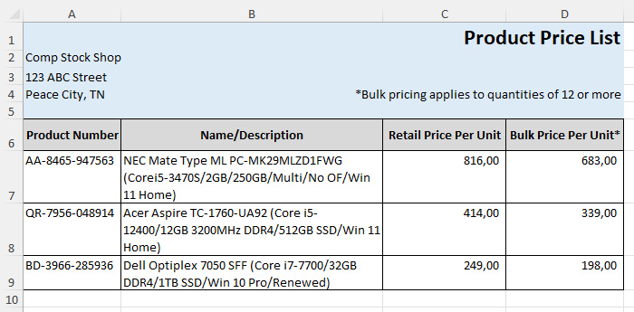
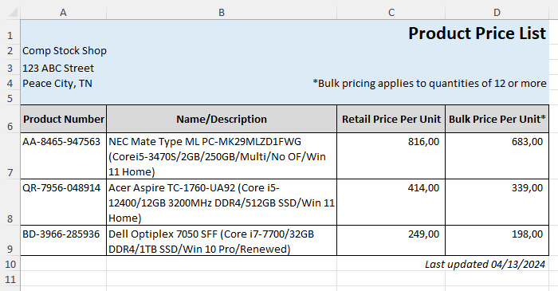

# FastExcelTemplator

**FastExcelTemplator** is a part of the **FastExcelPhp Project** which consists of

* [FastExcelWriter](https://packagist.org/packages/avadim/fast-excel-writer) - to create Excel spreadsheets
* [FastExcelReader](https://packagist.org/packages/avadim/fast-excel-reader) - to reader Excel spreadsheets
* [FastExcelTemplator](https://packagist.org/packages/avadim/fast-excel-templator) - to generate Excel spreadsheets from XLSX templates
* [FastExcelLaravel](https://packagist.org/packages/avadim/fast-excel-laravel) - special **Laravel** edition

## Introduction

**FastExcelTemplator** can generate Excel-compatible spreadsheets in XLSX format (Office 2007+) from XLSX templates,
very quickly and with minimal memory usage. This library is designed to be lightweight, super-fast and requires minimal memory usage.

**Features**

* Supports XLSX format only (Office 2007+) with multiple worksheets
* Transfers from templates to target spreadsheets styles, images, notes
* Replaces the entire cell values and substrings
* You can use any row from a template as row template to insert and replace a row with new values
* The library can read styling options of cells - formatting patterns, colors, borders, fonts, etc.

## Installation

Use `composer` to install **FastExcelTemplator** into your project:

```
composer require avadim/fast-excel-templator
```

## Templates Usage

Example of template



From this template you can get a file like this



**Step 1** - open template and set replacements
```php
// Open template and set output file
$excel = Excel::template($tpl, $out);
// Get the first sheet
$sheet = $excel->sheet();

$fillData = [
    '{{COMPANY}}' => 'Comp Stock Shop',
    '{{ADDRESS}}' => '123 ABC Street',
    '{{CITY}}' => 'Peace City, TN',
];

// Set replacements of entire cell values for the sheet
// If the value is '{{COMPANY}}', then this value will be replaced,
// but if the value 'Company Name {{COMPANY}}', then this value will not be replaced 
$sheet->fill($fillData);

// Set replacements of any occurring substrings
// If the value is '{{DATE}}' or 'Date: {{DATE}}', then substring '{{DATE}}' will be replaced,
$replaceData = ['{{BULK_QTY}}' => 12, '{{DATE}}' => date('m/d/Y')];
$sheet->replace($fillData);
```
**Step 2** - transfer the top of the sheet and the table headers from the template to the output file
```php
// Transfer rows 1-6 from templates to output file
$sheet->transferRowsUntil(6);
```
There are 6 rows read from template, the output file also contains 6 lines



**Step 3** - insert inner table rows
```php
// Get the row number 7 as a template and go to the next row in the template
$rowTemplate = $sheet->getRowTemplate(7);

// Fill row template and insert it into the output
foreach ($allData as $record) {
    $rowData = [
        // In the column A wil be written value from field 'number'
        'A' => $record['number'],
        // In the column B wil be written value from field 'description'
        'B' => $record['description'],
        // And so on...
        'C' => $record['price1'],
        'D' => $record['price2'],
    ];
    $sheet->insertRow($rowTemplate, $rowData);
}
```
We filled in and inserted rows 7, 8 and 9



**Step 4** - Now transfer the remaining rows and save file

```php
// Method transferRows() without arguments transfers remaining rows from the template to the output file 
$sheet->transferRows();

// ...
// Save new file
$excel->save();
```




You can find code examples in */demo* folder

## Modification of Spreadsheets

Use the ```row()``` method to read rows, modify them using callback, and write them to the output file.

```php
use avadim\FastExcelTemplator\Excel;

$excel = Excel::template($tpl, $out);
$sheet = $excel->sheet();

$sheet->rows(null, function ($sourceRowNum, $targetRowNum, $rowData) {
    // $rowData is an instance of the RowTemplate

    // skip the first row
    if ($rowNum === 1) {
        return null;
    }
    // $rowData
    // if a value of cell 'A' then break
    if ($rowData->getValue('A') > 5) {
        return false;
    }
    // write value to cell 'B'; if the cell 'B' does not exist, it will be created
    $rowData->setValue('B', $rowData->getValue('A') * 2);
    // return modified row
    return $rowData;
});
$excel->save();
```
You can add one or more cells to the end of a row in the callback function.
The styles and value from the source cell will be copied to the new cell.
If you do not explicitly specify a source cell, the last cell in the row will be used as the source.

```php
$sheet->rows(null, function ($sourceRowNum, $targetRowNum, $rowData) {
    // Clone the last cell of the row and add them to the end of the row and assign it the value 123
    $rowData->appendCell()->withValue(123);

    return $rowData;
});

$sheet->rows(null, function ($sourceRowNum, $targetRowNum, $rowData) {
    // Clone the cell 'B' and add them to the end
    $rowData->appendCell('B');

    // Clone the last cell three times
    $rowData->appendCell(null, 3)->withValues([111, 222, 333]);

    return $rowData;
});
```

Also, you can clone any cell (with styles and value) to other cell

```php
$sheet->rows(null, function ($sourceRowNum, $targetRowNum, $rowData) {
    // Clone the cell 'A' to the cell 'E' and assign it the SUM()
    $rowData->cloneCell('A', 'E')
        ->withValues(['=SUM(A' . $targetRowNum . ':E' . $targetRowNum . ')']);

    return $rowData;
});
```

If you need to remove cells, use the ```removeCells()```.

```php
$sheet->rows(null, function ($sourceRowNum, $targetRowNum, $rowData) {
    // Clone the cell 'A' to the cell 'E' and assign it the SUM()
    $rowData->removeCells(['B', 'D']);

    return $rowData;
});
```

## List of Functions
### Class Excel

Excel::template($template, $output): Excel -- Open template file

* sheet(?string $name = null): ?Sheet -- Select the specified sheet
* fill(array $replacement) -- Set replacements of the entire cell value for all sheets
* replace(array $replacement) -- Set replacements of substrings in a cells for all sheets
* save(?string $fileName = null, ?bool $overWrite = true): bool -- Save generated XLSX-file
* download(string $name = null): void -- Download generated file to client (send to browser)

### Class Sheet

* fill(array $replacement) -- Set replacements of the entire cell value for the sheet
* replace(array $replacement) -- Set replacements of substrings in a cell for the sheet
* getRowTemplate(int $rowNumber, ?bool $savePointerPosition = false) -- Gets template from the row
* getRowTemplates(int $rowNumberMin, int $rowNumberMax, ?bool $savePointerPosition = false) -- Gets row template
* transferRows(?int $countRows = null, $callback = null) -- Transfers rows from template to output
* transferRowsUntil(?int $maxRowNum = null, $callback = null) -- Transfers rows from template to output
* insertRow($rowTemplates, ?array $cellData = [])
* skipRows(?int $countRows = null)
* skipRowsUntil(?int $maxRowNum = null)

### Class RowTemplateCollection

* cloneCell(string $colSource, $colTarget, ?bool $checkMerge = false): RowTemplateCollection

## Do you like FastExcelTemplator?

if you find this package useful you can support and donate to me for a cup of coffee:

* USDT (TRC20) TSsUFvJehQBJCKeYgNNR1cpswY6JZnbZK7
* USDT (ERC20) 0x5244519D65035aF868a010C2f68a086F473FC82b
* ETH 0x5244519D65035aF868a010C2f68a086F473FC82b

Or just give me a star on GitHub :)