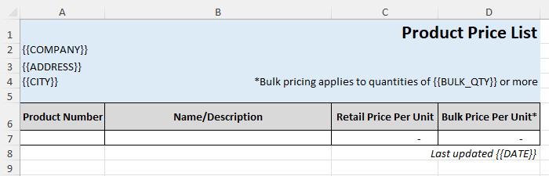
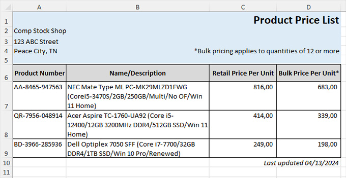
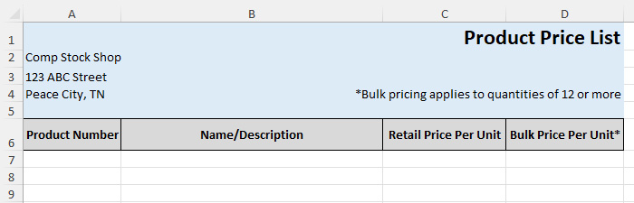
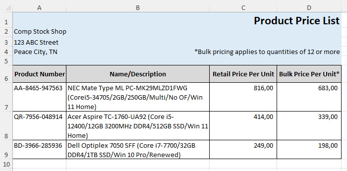
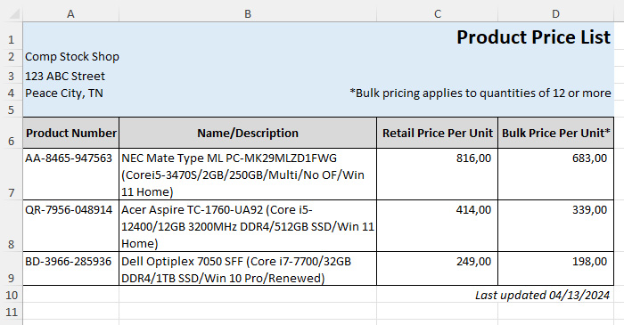

# FastExcelTemplator

[🇬🇧 English](README.md) · 🇷🇺 Русский

**FastExcelTemplator** — часть проекта **FastExcelPhp**, в который входят

* [FastExcelWriter](https://packagist.org/packages/avadim/fast-excel-writer) — создание Excel-таблиц
* [FastExcelReader](https://packagist.org/packages/avadim/fast-excel-reader) — чтение Excel-таблиц
* [FastExcelTemplator](https://packagist.org/packages/avadim/fast-excel-templator) — генерация Excel-таблиц из XLSX-шаблонов
* [FastExcelLaravel](https://packagist.org/packages/avadim/fast-excel-laravel) — специальная редакция для **Laravel**

## Введение

**FastExcelTemplator** генерирует Excel-совместимые таблицы в формате XLSX (Office 2007+) из XLSX-шаблонов —
очень быстро и с минимальным расходом памяти. Библиотека спроектирована лёгкой, очень быстрой и экономной по памяти.

**Возможности**

* Поддерживает только формат XLSX (Office 2007+), в том числе книги с несколькими листами
* Переносит из шаблона в результат стили, изображения и примечания
* Заменяет как значения ячеек целиком, так и подстроки
* Любую строку шаблона можно использовать как образец для вставки и замены строк новыми значениями
* Библиотека умеет читать параметры оформления ячеек — форматы, цвета, границы, шрифты и т. д.

## Какая библиотека мне нужна?

«Работа с Excel в PHP» — это на самом деле три разные задачи, и под каждую в семействе FastExcelPhp есть свой инструмент:

| Ваша задача | Инструмент |
|---|---|
| Прочитать данные из существующего файла | [FastExcelReader](https://github.com/aVadim483/fast-excel-reader) |
| Построить таблицу с нуля из кода | [FastExcelWriter](https://github.com/aVadim483/fast-excel-writer) |
| Заполнить готовый XLSX-бланк данными | **FastExcelTemplator** (эта библиотека) |

Берите **FastExcelTemplator**, когда у вас уже есть свёрстанный XLSX-документ (счёт, акт, договор, отчёт) и нужно лишь подставить в него данные — сохранив логотип, границы, форматы чисел и формулы, которые уже есть в файле. Если вы ловите себя на том, что воспроизводите в коде оформление, которое уже существует в файле, — вам нужен шаблонный подход.

## Установка

Установите **FastExcelTemplator** в проект через `composer`:

```
composer require avadim/fast-excel-templator
```

### Требования

* PHP >= 7.4 с расширениями `zip`, `json`, `mbstring`, `xmlreader` и `dom`.
* Composer подтягивает соседние пакеты автоматически. Текущая линейка 2.x зависит от:

  | Пакет | Ограничение |
  |---|---|
  | `avadim/fast-excel-reader` | `^4.0` |
  | `avadim/fast-excel-writer` | `^6.15` |
  | `avadim/fast-excel-helper` | `^1.3` |

## Как это работает

Понимание устройства объясняет и то, что библиотека делает без усилий, и то, где её границы.

* **Потоковая обработка, а не объектная модель.** FastExcelTemplator читает шаблон XML-ридером и тут же переписывает его XML-райтером — по одной строке, сверху вниз. Он никогда не загружает весь лист в память, поэтому расход памяти держится примерно на одном уровне независимо от числа вставленных строк.
* **Результат — это копия вашего шаблона.** При сохранении библиотека берёт исходный файл шаблона и вставляет в него только перезаписанные листы. Всё, что вы не трогали, — изображения, примечания, рисунки, объединённые ячейки, параметры печати, закреплённые области, автофильтры — переносится нетронутым. Именно поэтому оформление сохраняется «бесплатно»: это буквально тот же файл.
* **Только вперёд.** Поскольку чтение и запись идут одним проходом одновременно, нельзя вернуться и изменить уже записанную строку. По шаблону проходят один раз.
* **Формулы переносятся, но не вычисляются.** Библиотека записывает текст формулы и не считает её результат — это делает Excel при открытии файла. Когда захваченный образец строки вставляется в другую строку, его формулы перебазируются автоматически (ссылки A1 сдвигаются на целевую строку), так что `=C7*D7` в строке-образце становится `=C8*D8`, `=C9*D9` и так далее.

## Использование шаблонов

Пример шаблона



Из этого шаблона можно получить такой файл



**Шаг 1** — открыть шаблон и задать замены
```php
// Открываем шаблон и указываем выходной файл
$excel = Excel::template($tpl, $out);
// Берём первый лист
$sheet = $excel->sheet();

$fillData = [
    '{{COMPANY}}' => 'Comp Stock Shop',
    '{{ADDRESS}}' => '123 ABC Street',
    '{{CITY}}' => 'Peace City, TN',
];

// Замена значений ячеек целиком по всему листу.
// Значение '{{COMPANY}}' будет заменено,
// а 'Company Name {{COMPANY}}' — нет
$sheet->fill($fillData);

// Замена любых встречающихся подстрок.
// В значениях '{{DATE}}' или 'Date: {{DATE}}' подстрока '{{DATE}}' будет заменена
$replaceData = ['{{BULK_QTY}}' => 12, '{{DATE}}' => date('m/d/Y')];
$sheet->replace($replaceData);
```

**`fill()` vs `replace()`** — самые частые грабли:

* `fill()` заменяет значение, **только если вся ячейка равна ключу**. Ячейка `{{COMPANY}}` заменится; ячейка `Company Name {{COMPANY}}` — **нет**.
* `replace()` заменяет ключ как **подстроку**, в любом месте текста ячейки.

Обе карты применяются к каждой ячейке, которую библиотека пишет в вывод, — и к переносимым, и к вставляемым строкам.

**Шаг 2** — перенести верх листа и заголовки таблицы из шаблона в выходной файл
```php
// Переносим строки 1–6 из шаблона в выходной файл
$sheet->transferRowsUntil(6);
```
Из шаблона прочитано 6 строк, в выходном файле тоже 6 строк



**Шаг 3** — вставить внутренние строки таблицы
```php
// Берём строку 7 как образец и переходим к следующей строке шаблона
$rowTemplate = $sheet->getRowTemplate(7);

// Заполняем образец строки и вставляем его в вывод
foreach ($allData as $record) {
    $rowData = [
        // В колонку A запишется значение из поля 'number'
        'A' => $record['number'],
        // В колонку B — значение из поля 'description'
        'B' => $record['description'],
        // И так далее...
        'C' => $record['price1'],
        'D' => $record['price2'],
    ];
    $sheet->insertRow($rowTemplate, $rowData);
}
```
Мы заполнили и вставили строки 7, 8 и 9



**Шаг 4** — теперь переносим оставшиеся строки и сохраняем файл

```php
// Метод transferRows() без аргументов переносит оставшиеся строки шаблона в вывод
$sheet->transferRows();

// ...
// Сохраняем новый файл
$excel->save();
```




Примеры кода можно найти в папке */demo*

## Изменение таблиц

Метод ```rows()``` читает строки, изменяет их через колбэк и пишет в выходной файл.

```php
use avadim\FastExcelTemplator\Excel;

$excel = Excel::template($tpl, $out);
$sheet = $excel->sheet();

$sheet->rows(function ($sourceRowNum, $targetRowNum, $rowData) {
    // $rowData — экземпляр RowTemplate

    // пропустить первую строку
    if ($sourceRowNum === 1) {
        return null;
    }
    // прервать обработку, если значение ячейки 'A' больше 5
    if ($rowData->getValue('A') > 5) {
        return false;
    }
    // записать значение в ячейку 'B'; если ячейки 'B' нет, она будет создана
    $rowData->setValue('B', $rowData->getValue('A') * 2);
    // вернуть изменённую строку
    return $rowData;
});
$excel->save();
```
В колбэке можно добавить одну или несколько ячеек в конец строки.
Стили и значение из исходной ячейки будут скопированы в новую.
Если явно не указать исходную ячейку, за образец берётся последняя ячейка строки.

```php
$sheet->rows(function ($sourceRowNum, $targetRowNum, $rowData) {
    // Клонировать последнюю ячейку строки, добавить в конец и присвоить значение 123
    $rowData->appendCell()->withValue(123);

    return $rowData;
});

$sheet->rows(function ($sourceRowNum, $targetRowNum, $rowData) {
    // Клонировать ячейку 'B' и добавить в конец
    $rowData->appendCell('B');

    // Клонировать последнюю ячейку три раза
    $rowData->appendCell(null, 3)->withValues([111, 222, 333]);

    return $rowData;
});
```

Также можно клонировать любую ячейку (со стилями и значением) в другую ячейку

```php
$sheet->rows(function ($sourceRowNum, $targetRowNum, $rowData) {
    // Клонировать ячейку 'A' в 'E' и присвоить формулу SUM()
    $rowData->cloneCell('A', 'E')
        ->withValues(['=SUM(A' . $targetRowNum . ':E' . $targetRowNum . ')']);

    return $rowData;
});
```

Чтобы удалить ячейки, используйте ```removeCells()```.

```php
$sheet->rows(function ($sourceRowNum, $targetRowNum, $rowData) {
    // Удалить лишние столбцы
    $rowData->removeCells(['B', 'D']);

    return $rowData;
});
```

## Повторяющиеся строки и чередование стилей

`getRowTemplate($n)` берёт одну строку как переиспользуемый образец. Чтобы повторять **блок** из нескольких строк — или чередовать стили строк («зебра») — захватите диапазон через `getRowTemplates($min, $max)`:

```php
// Захватываем две по-разному оформленные строки-образца (7 и 8)
$rowTemplates = $sheet->getRowTemplates(7, 8);

foreach ($allData as $record) {
    // insertRow() циклически перебирает образцы: 7, 8, 7, 8, ...
    $sheet->insertRow($rowTemplates, ['A' => $record['number']]);
}
```

Оба метода возвращают `RowTemplateCollection`; `insertRow()` на каждый вызов берёт из неё следующий образец и по достижении конца начинает сначала.

## Работа с несколькими листами

Шаблон может содержать несколько листов. Обратитесь к листу по имени через `sheet($name)` или переберите все листы через `sheets()`:

```php
$excel = Excel::template($tpl, $out);

foreach ($excel->sheets() as $sheet) {
    $sheet->fill(['{{TITLE}}' => 'Report']);
    $sheet->transferRows();
}

$excel->save();
```

## Отдача файла в браузер

Кроме `save()`, готовый файл можно отправить клиенту напрямую с нужными HTTP-заголовками:

```php
$excel->download('invoice.xlsx'); // ставит заголовки скачивания и отдаёт файл
$excel->output('invoice.xlsx');   // output() — псевдоним download()
```

`download()` отдаёт один файл на ответ, поэтому чтобы передать сразу много документов, сохраните их и упакуйте в архив самостоятельно.

## Ограничения

FastExcelTemplator сделан под одну задачу — заполнение XLSX-шаблонов — и сознательно делает не всё:

* **Только XLSX** (Office 2007+). Старый бинарный `.xls` нельзя использовать как шаблон; сначала пересохраните его в `.xlsx`.
* **Только вперёд.** Шаблон обрабатывается одним проходом сверху вниз; нельзя изменить уже записанную строку.
* **Формулы не вычисляются.** Библиотека записывает текст формулы (и перебазирует его); результат считает Excel при открытии файла.
* **Плейсхолдеры — только подстановка значений**: логики внутри ячейки нет (никаких `if`/циклов). Таблица неизвестной длины делается через образцы строк, а не через плейсхолдеры.
* **Это не ридер и не запись с нуля.** Чтобы прочитать данные из файла, используйте [FastExcelReader](https://github.com/aVadim483/fast-excel-reader); чтобы построить таблицу целиком из кода — [FastExcelWriter](https://github.com/aVadim483/fast-excel-writer).

## FAQ

**Плейсхолдер не заменился.**
Проверьте `fill()` vs `replace()`. `fill()` заменяет только ячейку, значение которой в точности равно ключу; если метка сидит внутри другого текста (например, `Date: {{DATE}}`), используйте `replace()`, который ищет подстроки.

**Формула отображается как текст, или ячейка пуста, пока не открою файл.**
Библиотека записывает формулы, но не вычисляет их — результат считает Excel при открытии файла. Убедитесь, что значение — настоящая формула, начинающаяся с `=`.

**Как сохранить логотип / изображения / примечания из шаблона?**
Они сохраняются автоматически. Результат — копия шаблона, в которой перезаписаны только данные листа, поэтому всё, чего вы не трогали, остаётся на месте — достаточно `fill()`/`replace()` и переноса строк.

**Получаю `Allowed memory size exhausted` на большом файле.**
Библиотека работает потоково, поэтому узкое место обычно — ваш источник данных. Тяните строки из базы курсором/генератором, а не загружайте их все в массив (`fetchAll()`) перед циклом вставки.

**Можно ли использовать старый файл `.xls` как шаблон?**
Нет. Поддерживается только XLSX (Office 2007+). Пересохраните `.xls` в `.xlsx` (например, в Excel или LibreOffice) и используйте результат как шаблон.

## Список функций

* [Класс Excel](docs/91-api-class-excel.md)
* [Класс SheetTemplate](docs/92-api-class-sheet-template.md)
* [Класс RowTemplate](docs/93-api-class-row-template.md)
* [Класс RowTemplateCollection](docs/94-api-class-row-template-collection.md)

## Вам нравится FastExcelTemplator?

Если пакет оказался полезным, вы можете поддержать автора и угостить его чашкой кофе:

* USDT (TRC20) TSsUFvJehQBJCKeYgNNR1cpswY6JZnbZK7
* USDT (ERC20) 0x5244519D65035aF868a010C2f68a086F473FC82b
* ETH 0x5244519D65035aF868a010C2f68a086F473FC82b

Или просто поставьте звезду на GitHub :)
